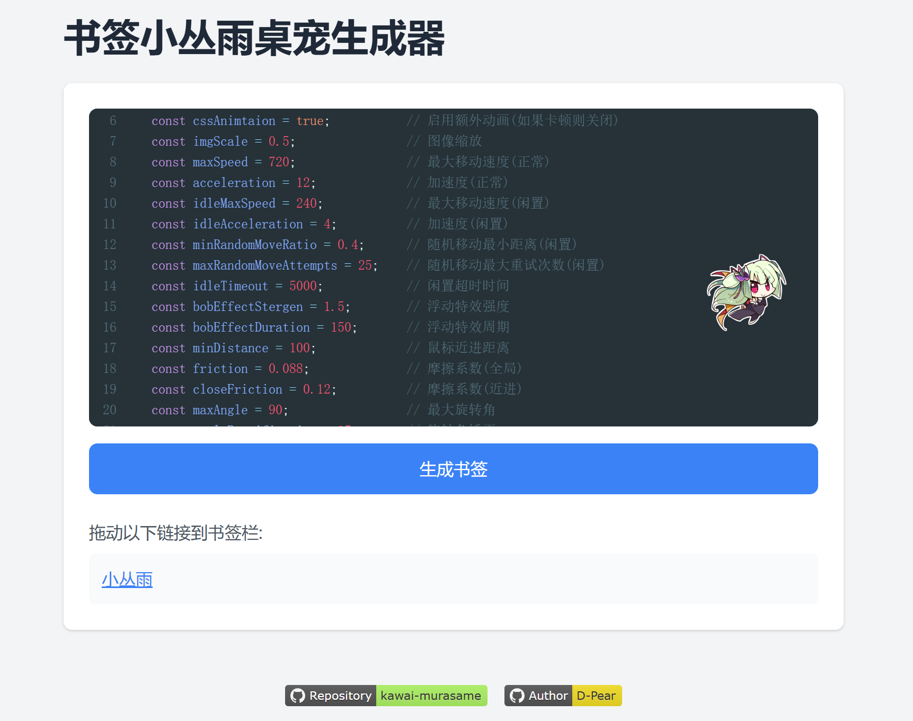

<figure class="half">
    </img>
    <h1>小丛雨桌宠</h1>
</figure>

    本项目为可随意嵌入网页的小丛雨桌宠, 并且提供了一个书签工具生成器, 可以做到点击浏览器书签向当前网页添加可以自由飘动的小丛雨桌宠
    </img>

## 使用方法
### 作为书签使用
 1. 访问本仓库的[GitHub Pages](https://d-pear.github.io/kawai-murasame/)  
 2. 在编辑框中修改需要自定义的参数  
 3. 点击生成书签按钮并将生成的书签连接拖动到书签栏  
 4. 在想要使用的页面点击书签即可召唤小丛雨  

### 油猴脚本
  施工中 🚧

### 嵌入自己的网站
  将仓库目录下的`murasame.js`插入到网站的每个页面中即可

## 特性
 - 当鼠标移动(或者触屏点击时)时, 小丛雨会自动跟随鼠标(或点击位置)
 - 当鼠标闲置超过一定时间后(默认5s), 会随机在页面上面漫游
 - 可以使用鼠标或者触摸拖拽小丛雨
 - 可以双击小丛雨进入冻结模式, 在该模式下小丛雨不会移动, 但是会持续看向鼠标位置, 并且会有爱心特效

## 关于
 - 本项目的源代码使用GPL v3许可证分发, 您可以在符合协议的情况下自由修改本项目给自己喜欢的角色
 - 本项目所用到的图像资产均为ゆずソフト(Yuzusoft)所有, 作者不拥有任何权力
 - 您可以自动二次传播或者再分发本软件, 但是必须标明出处(即本GitHub项目链接)以及作者信息
 - 您不得在任意地方出售本项目的原始代码